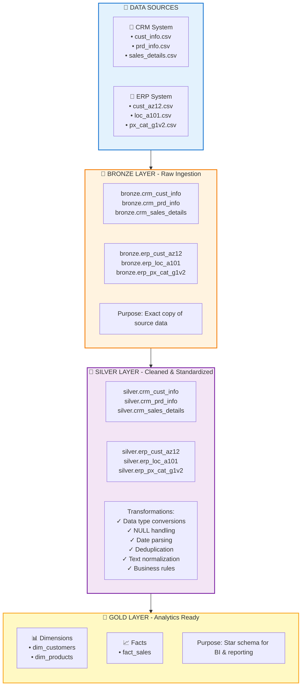

# 🏢 SQL Data Warehouse Project


> A production-ready, three-tier ELT data warehouse built on PostgreSQL, demonstrating modern data engineering best practices with Bronze → Silver → Gold architecture.

---

## 📖 Introduction

This project implements a **complete end-to-end data warehouse solution** using PostgreSQL, designed to transform raw business data from multiple sources (CRM and ERP systems) into analytics-ready dimensional models. The warehouse follows the **medallion architecture** pattern with three distinct layers:

- **🥉 Bronze Layer**: Raw data ingestion from CSV files with minimal transformation
- **🥈 Silver Layer**: Cleaned, validated, and standardized business data
- **🥇 Gold Layer**: Star schema dimensional model optimized for analytics and reporting

The project showcases real-world data engineering challenges including data quality issues, schema mismatches, type conversions, and performance optimization.

---

## 🎯 Skills & Technologies Demonstrated

### **Database & SQL**
- ✅ PostgreSQL database design and administration
- ✅ Advanced SQL queries (CTEs, Window Functions, CASE statements)
- ✅ PL/pgSQL stored procedures for ETL automation
- ✅ Database schema design (Bronze/Silver/Gold layers)
- ✅ Index optimization for query performance

### **Data Engineering**
- ✅ ELT (Extract, Load, Transform) pipeline implementation
- ✅ Data quality validation and cleansing
- ✅ Data type standardization and normalization
- ✅ Handling missing/invalid data
- ✅ Deduplication strategies (ROW_NUMBER, PARTITION BY)

### **Data Modeling**
- ✅ Star schema design (Fact and Dimension tables)
- ✅ Surrogate key management
- ✅ Slowly Changing Dimensions (SCD Type 2 concepts)
- ✅ Referential integrity and foreign key relationships

### **Best Practices**
- ✅ Modular script organization
- ✅ Comprehensive data quality checks
- ✅ Error handling and logging
- ✅ Performance monitoring (execution timing)
- ✅ Documentation and code comments

---

## 🏗️ Architecture Overview



---

## 📂 Project Structure

```
sql-data-warehouse-project-main/
│
├── 📁 datasets/
│   ├── source_crm/          # CRM system data files
│   │   ├── cust_info.csv
│   │   ├── prd_info.csv
│   │   └── sales_details.csv
│   │
│   └── source_erp/          # ERP system data files
│       ├── cust_az12.csv
│       ├── loc_a101.csv
│       └── px_cat_g1v2.csv
│
├── 📁 scripts/
│   ├── init_database.sql           # Database & schema creation
│   ├── init_indexes.sql            # Performance indexes
│   │
│   ├── 📁 bronze/
│   │   ├── ddl_bronze.sql          # Bronze table definitions
│   │   └── proc_load_bronze.sql    # Bronze data load procedure
│   │
│   ├── 📁 silver/
│   │   ├── ddl_silver.sql          # Silver table definitions
│   │   └── proc_load_silver.sql    # Silver ETL procedure
│   │
│   └── 📁 gold/
│       └── ddl_gold.sql            # Gold views (star schema)
│
├── 📁 tests/
│   ├── quality_checks_silver.sql   # Silver layer validation
│   └── quality_checks_gold.sql     # Gold layer validation
│
└── 📄 README.md                    # This file
```

---

## 🔧 What Was Done

### **1. Data Quality Fixes**
- ✅ Fixed hardcoded file paths to use project-relative paths
- ✅ Resolved case-sensitivity issues in CSV filenames
- ✅ Corrected data types (INTEGER → NUMERIC for financial columns)
- ✅ Fixed unstable surrogate keys in Gold views
- ✅ Updated test scripts to validate correct layer (Silver vs Bronze)

### **2. Schema Design**
- ✅ Created three-layer architecture (Bronze/Silver/Gold)
- ✅ Implemented proper data types with precision (NUMERIC(10,2))
- ✅ Added timestamp tracking (dwh_create_date)
- ✅ Designed star schema with dimension and fact tables

### **3. ETL Implementation**
- ✅ Built PL/pgSQL procedures for automated data loading
- ✅ Implemented data cleansing logic (TRIM, CASE statements)
- ✅ Added deduplication (ROW_NUMBER window functions)
- ✅ Created date parsing and validation logic
- ✅ Implemented business rule transformations

### **4. Performance Optimization**
- ✅ Created indexes on primary and foreign keys
- ✅ Added execution timing to ETL procedures
- ✅ Optimized join conditions in Gold views

### **5. Quality Assurance**
- ✅ Built comprehensive data quality check scripts
- ✅ Added validation for NULL values, duplicates, and invalid dates
- ✅ Implemented referential integrity checks
- ✅ Created data consistency validations

---

## 🚀 How to Run

### **Prerequisites**
- PostgreSQL 12+ installed and running
- Database client (pgAdmin, DBeaver, or psql CLI)
- Superuser or database creation privileges

### **Step-by-Step Execution**

#### **1️⃣ Initialize Database & Schemas**
```sql
-- Run in your PostgreSQL client
\i scripts/init_database.sql
```
> **Note**: If using a GUI tool, manually switch to the `DataWarehouse` database after creation.

#### **2️⃣ Create Bronze Layer Tables**
```sql
-- Connect to DataWarehouse database first
\i scripts/bronze/ddl_bronze.sql
```

#### **3️⃣ Create Silver Layer Tables**
```sql
\i scripts/silver/ddl_silver.sql
```

#### **4️⃣ Create Gold Layer Views**
```sql
\i scripts/gold/ddl_gold.sql
```

#### **5️⃣ Load Bronze Layer Data**
```sql
-- Execute the Bronze load procedure
CALL bronze.load_bronze_layer();
```
> **Expected Output**: Progress messages showing load duration for each table

#### **6️⃣ Transform to Silver Layer**
```sql
-- Execute the Silver ETL procedure
CALL silver.load_silver_layer();
```
> **Expected Output**: Transformation progress with timing metrics

#### **7️⃣ Create Performance Indexes**
```sql
\i scripts/init_indexes.sql
```

#### **8️⃣ Validate Data Quality**
```sql
-- Run quality checks
\i tests/quality_checks_silver.sql
\i tests/quality_checks_gold.sql
```
> **Expected Output**: No results for most checks (indicating data quality)

#### **9️⃣ Query the Gold Layer**
```sql
-- Example analytics queries
SELECT * FROM gold.dim_customers LIMIT 10;
SELECT * FROM gold.dim_products LIMIT 10;
SELECT * FROM gold.fact_sales LIMIT 10;

-- Sample business query: Top 10 customers by sales
SELECT 
    c.customer_number,
    c.first_name,
    c.last_name,
    SUM(f.sales_amount) as total_sales
FROM gold.fact_sales f
JOIN gold.dim_customers c ON f.customer_key = c.customer_key
GROUP BY c.customer_number, c.first_name, c.last_name
ORDER BY total_sales DESC
LIMIT 10;
```

---

## 📊 Sample Queries

### **Customer Analysis**
```sql
-- Customer demographics by country
SELECT 
    country,
    gender,
    COUNT(*) as customer_count
FROM gold.dim_customers
WHERE country != 'n/a'
GROUP BY country, gender
ORDER BY country, customer_count DESC;
```

### **Product Performance**
```sql
-- Sales by product category
SELECT 
    p.category,
    p.subcategory,
    COUNT(DISTINCT f.order_number) as order_count,
    SUM(f.sales_amount) as total_revenue,
    AVG(f.sales_amount) as avg_order_value
FROM gold.fact_sales f
JOIN gold.dim_products p ON f.product_key = p.product_key
GROUP BY p.category, p.subcategory
ORDER BY total_revenue DESC;
```

### **Time-Based Analysis**
```sql
-- Monthly sales trend
SELECT 
    DATE_TRUNC('month', order_date) as sales_month,
    COUNT(*) as order_count,
    SUM(sales_amount) as monthly_revenue
FROM gold.fact_sales
WHERE order_date IS NOT NULL
GROUP BY DATE_TRUNC('month', order_date)
ORDER BY sales_month;
```

---

## ✅ Data Quality Checks

The project includes comprehensive quality validations:

### **Silver Layer Checks**
- ✓ Primary key uniqueness and NULL validation
- ✓ Unwanted whitespace detection
- ✓ Data standardization verification
- ✓ Invalid date range detection
- ✓ Business rule consistency (sales = quantity × price)

### **Gold Layer Checks**
- ✓ Surrogate key uniqueness
- ✓ Referential integrity (fact-to-dimension joins)
- ✓ Orphaned record detection

---

## 🎓 Learning Outcomes

By studying and running this project, you will learn:

1. **Data Warehouse Design**: Understanding of medallion architecture and its benefits
2. **SQL Mastery**: Advanced SQL techniques including window functions, CTEs, and dynamic SQL
3. **ETL Development**: Building robust data pipelines with error handling
4. **Data Quality**: Implementing validation and cleansing strategies
5. **Performance Tuning**: Index design and query optimization
6. **Best Practices**: Code organization, documentation, and testing

---

## 🔍 Key Features

- 🎯 **Production-Ready**: Includes error handling, logging, and quality checks
- ⚡ **Performance Optimized**: Indexed tables and efficient queries
- 📈 **Scalable Design**: Modular architecture supports easy extension
- 🧪 **Well-Tested**: Comprehensive validation scripts included
- 📚 **Well-Documented**: Clear comments and README

---

## 🛠️ Troubleshooting

### **Issue: File Not Found Error**
- **Cause**: PostgreSQL server cannot access CSV file paths
- **Solution**: Verify paths in `proc_load_bronze.sql` match your system

### **Issue: Permission Denied**
- **Cause**: Insufficient database privileges
- **Solution**: Run as superuser or grant necessary permissions

### **Issue: Data Type Errors**
- **Cause**: CSV data doesn't match expected format
- **Solution**: Review Bronze layer data and adjust transformations

---

## 📝 Notes

- The project uses **full reload** strategy (TRUNCATE + INSERT)
- Gold layer uses **views** for real-time data access
- Financial columns use `NUMERIC(10,2)` for precision
- Indexes are created on all join keys for performance

---

## 🎉 Conclusion

This project demonstrates a complete, production-quality data warehouse implementation using PostgreSQL. It showcases essential data engineering skills including ETL development, data modeling, quality assurance, and performance optimization.

**Perfect for**: Data engineering portfolios, learning SQL/PostgreSQL, understanding data warehouse concepts, or as a foundation for larger projects.

---

## 📧 Contact & Support

For questions, issues, or improvements, feel free to open an issue or submit a pull request!

---

**Happy Data Engineering! 🚀📊**
